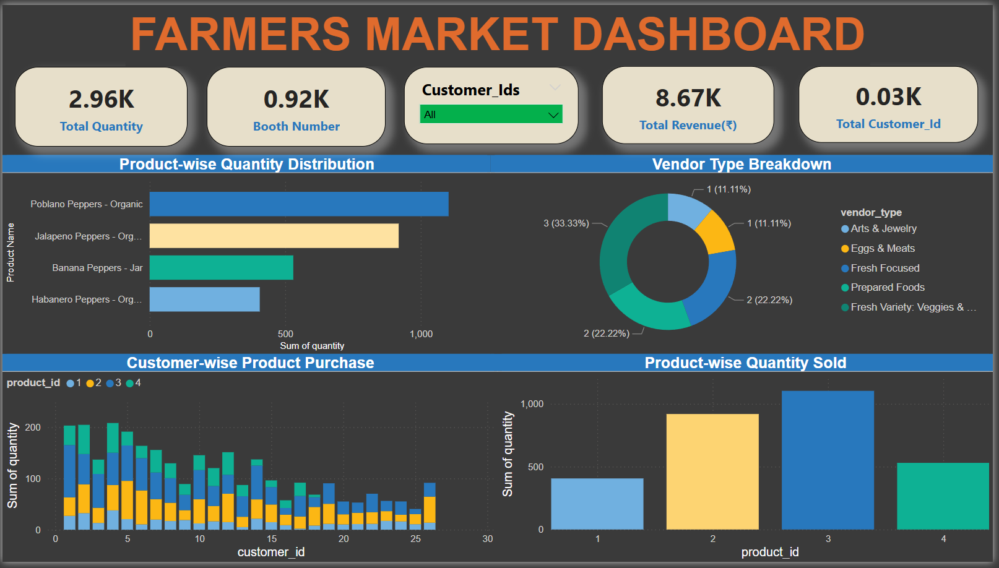

# Farmer Market Data Analysis (Power BI)

## 📌 Project Overview
This project analyzes farmer market transactional data to uncover insights into product sales, customer behavior, vendor performance, and inventory distribution using **Power BI**.

## 📊 Dashboard Preview

## 🛠 Tools & Technologies
- Power BI
- DAX
- Pandas (data cleaning)
- Excel
- CSV datasets

## 📂 Dataset Description
The project uses multiple CSV files including:
- Customer details
- Purchase transactions
- Product and category information
- Vendor and booth assignments
- Market date and inventory data

## 📊 Key Analysis Performed
- Data cleaning and transformation
- Data modeling with relationships
- DAX measures for KPIs
- Sales and revenue analysis
- Vendor and product performance analysis
- Interactive dashboards with filters and drill-downs

## 🚀 Key Insights
- Identified top-performing vendors and products
- Analyzed customer purchase patterns
- Evaluated inventory distribution across vendors
- Tracked sales trends over time

## 📁 Files in Repository
- `data/` → Raw CSV datasets
- `Farmers_Dashboard.pbix` → Power BI dashboard file

## 👤 Author
Gaurav Kumar Jha
(Data Analyst | Power BI | SQL | Python)
